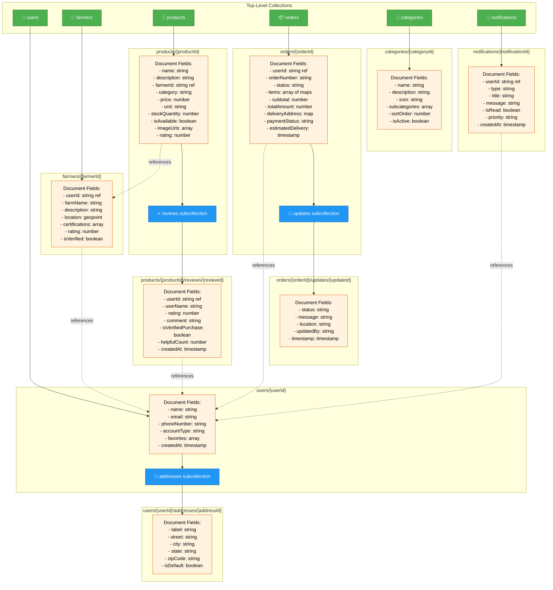

# Farm2Home Firestore Schema Diagram

## Visual Database Structure



## Simplified ER-Style Diagram

```
┌─────────────────────────────────────────────────────────────────┐
│                         FIRESTORE DATABASE                       │
└─────────────────────────────────────────────────────────────────┘

┌──────────────┐         ┌──────────────┐         ┌──────────────┐
│    users     │         │   farmers    │         │  products    │
│──────────────│         │──────────────│         │──────────────│
│ • userId (PK)│────────>│ • farmerId   │────────>│ • productId  │
│ • name       │         │ • userId (FK)│         │ • farmerId   │
│ • email      │         │ • farmName   │         │ • name       │
│ • phone      │         │ • location   │         │ • price      │
│ • favorites[]│         │ • rating     │         │ • category   │
└──────────────┘         │ • verified   │         │ • stock      │
       │                 └──────────────┘         │ • rating     │
       │                                          └──────────────┘
       │                                                 │
       │                                                 │
       ▼                                                 ▼
┌──────────────┐                              ┌──────────────────┐
│  addresses   │                              │     reviews      │
│ (subcoll)    │                              │   (subcollection)│
│──────────────│                              │──────────────────│
│ • addressId  │                              │ • reviewId       │
│ • street     │                              │ • userId (FK)    │
│ • city       │                              │ • rating         │
│ • isDefault  │                              │ • comment        │
└──────────────┘                              │ • verified       │
                                              └──────────────────┘

┌──────────────┐         ┌──────────────────┐
│    orders    │         │  notifications   │
│──────────────│         │──────────────────│
│ • orderId(PK)│         │ • notificationId │
│ • userId(FK) │<────────│ • userId (FK)    │
│ • orderNum   │         │ • type           │
│ • status     │         │ • title          │
│ • items[]    │         │ • message        │
│ • total      │         │ • isRead         │
│ • address    │         │ • priority       │
└──────────────┘         └──────────────────┘
       │
       │
       ▼
┌──────────────┐         ┌──────────────┐
│   updates    │         │ categories   │
│ (subcoll)    │         │──────────────│
│──────────────│         │ • categoryId │
│ • updateId   │         │ • name       │
│ • status     │         │ • icon       │
│ • message    │         │ • subcats[]  │
│ • timestamp  │         │ • sortOrder  │
└──────────────┘         └──────────────┘

Legend:
────> : References (Foreign Key)
(PK)  : Primary Key (Document ID)
(FK)  : Foreign Key Reference
[]    : Array field
(subcoll) : Subcollection
```

## ASCII Data Flow Diagram

```
┌─────────────┐
│   Customer  │
└──────┬──────┘
       │
       │ 1. Browse Products
       ▼
┌─────────────────────────┐
│   products collection   │
│  ┌─────────────────┐   │
│  │ Filter by cat   │   │
│  │ Search by name  │   │
│  │ Sort by rating  │   │
│  └─────────────────┘   │
└─────────┬───────────────┘
          │
          │ 2. View Reviews
          ▼
    ┌──────────────┐
    │products/{id}/│
    │   reviews/   │
    └──────────────┘
          │
          │ 3. Add to Cart
          ▼
    ┌──────────────┐
    │ Client-side  │
    │   cart       │
    └──────┬───────┘
           │
           │ 4. Place Order
           ▼
    ┌──────────────┐      ┌────────────────┐
    │   orders/    │─────>│  Notify User   │
    │ {orderId}    │      │ notifications/ │
    └──────┬───────┘      └────────────────┘
           │
           │ 5. Track Order
           ▼
    ┌──────────────┐
    │ orders/{id}/ │
    │  updates/    │
    └──────────────┘
```

## Collection Relationships Summary

| Parent Collection | Subcollection | Relationship | Purpose |
|------------------|---------------|--------------|---------|
| `users` | `addresses` | 1:Many | Multiple delivery addresses per user |
| `products` | `reviews` | 1:Many | Multiple customer reviews per product |
| `orders` | `updates` | 1:Many | Status tracking history per order |
| `orders` | N/A (top-level) | N/A | Enables cross-user queries for admin |
| `farmers` | N/A (top-level) | References `users` | Farmer profiles separate from products |
| `products` | N/A (top-level) | References `farmers` | All products queryable together |
| `categories` | N/A (top-level) | Referenced by products | Browse and filter support |
| `notifications` | N/A (top-level) | References `users` | User-specific notifications |

## Key Design Patterns

### ✅ Subcollections Used For:
- **High Volume Data**: Reviews can be thousands per product
- **Independent Updates**: Order updates don't affect order document
- **Lazy Loading**: Addresses loaded only when needed
- **Pagination**: Easy "load more" implementation

### ✅ Top-Level Collections For:
- **Cross-Entity Queries**: All orders for admin dashboard
- **Multiple References**: Products referenced by orders, reviews, favorites
- **Public Data**: Categories browsed by all users
- **Independent Lifecycle**: Farmers exist independently of products

### ✅ References (IDs) Instead of Embedding:
- **Prevents Duplication**: Product updates don't require order updates
- **Flexibility**: Easy to query relationships
- **Consistency**: Single source of truth for farmer/user data
- **Trade-off**: Denormalize display names (userName in reviews) for performance

## Schema Evolution Plan

### Phase 1 (Current): Core E-commerce
- ✅ Users, Products, Orders, Farmers, Reviews

### Phase 2: Enhanced Features
- 🔜 Add `carts` collection (move from client-side)
- 🔜 Add `promotions` collection (discount codes, sales)
- 🔜 Add `inventory` subcollection for farmers

### Phase 3: Community Features
- 🔜 Add `conversations` (user-farmer chat)
- 🔜 Add `posts` (farmer blog posts, updates)
- 🔜 Add `subscriptions` (recurring deliveries)

### Phase 4: Analytics & Admin
- 🔜 Add `analytics` collection (aggregated stats)
- 🔜 Add `admin_logs` (audit trail)
- 🔜 Export to BigQuery for advanced analytics

---

This visual representation helps developers understand the database structure at a glance and makes implementation much easier! 🎨
